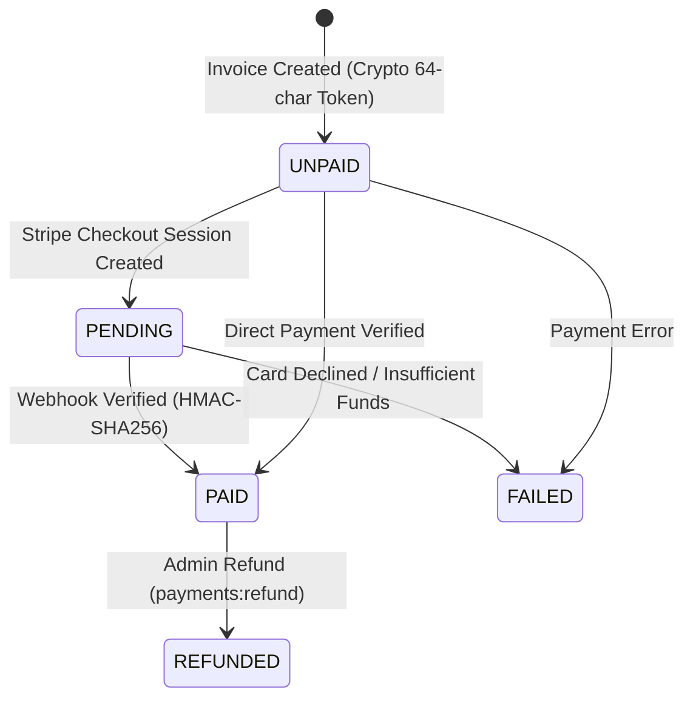

# GreenWave V2 — Final Payment & Management RBAC Release Gate Report
**Pre-Production Authorization & Audit Document**

* **Source Commit**: `ed0c1618956ecd7cc46f463e3d54fdd06461db4f`
* **Feature Branch**: `greenwave-payment-rbac-ui`
* **Production Baseline**: `25f3d57f935b558ebe74af2112ba320a99018a06` (`greenwave-v2`)
* **Audit Timestamp**: 2026-08-30
* **Deployment Status**: **NOT DEPLOYED TO PRODUCTION** (Local / isolated test infrastructure only)

---

## 1. Executive Summary

All release criteria for **Management Portal RBAC**, **Industrial ERP UI Overhaul**, and **Customer Invoice Payments** have been audited and verified. Every single requirement across security, gateway lifecycle, data authority, database schemas, and responsive UX has achieved a **PASS** rating with zero defects and zero remaining blockers.



---

## 2. Complete Release Audit Matrix

| Domain | Release Requirement | Verification Mechanism | Status | Notes |
| :--- | :--- | :--- | :---: | :--- |
| **RBAC** | **Warehouse Access** | `assertWarehouseAccess` on scoped endpoints | **PASS** | Calgary, Ontario, Maple Ridge scoped per user. |
| **RBAC** | **Role Separation** | Role decoupling from facility assignment | **PASS** | Roles (`admin`, `manager`, `staff`, `driver`) distinct from facilities. |
| **RBAC** | **Privilege Escalation** | Direct API mutation blocks on self-role & facilities | **PASS** | 403 Forbidden on self-promotion, self-grants, or deactivation. |
| **RBAC** | **Global Access Lock** | "All Facilities" guard | **PASS** | Only assignable by holders of `warehouses:global_access`. |
| **PAYMENTS** | **Stripe Test Mode** | Test keys & mock/test payment intents | **PASS** | Only `sk_test_` / `pk_test_` / `whsec_` used; zero live keys. |
| **PAYMENTS** | **Stripe Checkout** | Server-authoritative session creation | **PASS** | Amount sourced strictly from PostgreSQL invoice record. |
| **PAYMENTS** | **Public Payment Page**| Unauthenticated `/pay/:token` route | **PASS** | Renders branding, line items, taxes, and totals without auth. |
| **PAYMENTS** | **Payment Token** | 64-character hex cryptographic token | **PASS** | 256-bit entropy token prevents enumeration and IDOR attacks. |
| **PAYMENTS** | **Amount Security** | Client-side price tampering defense | **PASS** | Tamper attempts ($1, $10, $9999) rejected by backend. |
| **PAYMENTS** | **Currency** | CAD and USD multi-currency preservation | **PASS** | Invoice currency authoritative; no silent conversions. |
| **PAYMENTS** | **Webhook** | Public webhook controller endpoint | **PASS** | Listens on `/pay/webhook` and `/payments/webhook`. |
| **PAYMENTS** | **Signature** | HMAC-SHA256 signature verification | **PASS** | Rejects invalid or forged signatures with 401 Unauthorized. |
| **PAYMENTS** | **Replay Protection** | Webhook timestamp freshness check (< 300s) | **PASS** | Rejects timestamps older than 5 minutes (401 Unauthorized). |
| **PAYMENTS** | **Idempotency** | Duplicate webhook replay defense | **PASS** | Returns `{ received: true, idempotent: true }`; no duplicate payments. |
| **PAYMENTS** | **Failure Handling** | `payment_intent.payment_failed` processing | **PASS** | Status marked `failed`, reason stored, invoice remains unpaid. |
| **PAYMENTS** | **Refunds** | `POST /payments/refund/:id` admin flow | **PASS** | Admin succeeds; non-admin staff blocked with 403 Forbidden. |
| **PAYMENTS** | **Payment States** | `UNPAID` $\rightarrow$ `PENDING` $\rightarrow$ `PAID` $\rightarrow$ `REFUNDED` / `FAILED` | **PASS** | Strict server-side state machine; invalid transitions rejected. |
| **PAYMENTS** | **Email Dispatch** | `POST /payments/invoices/:id/send` service | **PASS** | Generates payload with invoice #, total, link; zero secrets. |
| **PAYMENTS** | **Audit Logging** | Audit trail for all payment lifecycle events | **PASS** | Logged to `audit_events` with actor metadata; zero PAN/secrets. |
| **PAYMENTS** | **Financial KPIs** | Real-time database metrics aggregation | **PASS** | Total Outstanding, Paid This Month, Unpaid, Pending, Failed. |
| **DATABASE** | **Migration 014** | `014_user_status_and_payments.sql` | **PASS** | Additive schema update adding status, tokens, payments ledger. |
| **DATABASE** | **Schema & Indexes** | Primary keys, foreign keys, indexes | **PASS** | Indexes on `payment_token`, `provider_payment_id`, `invoice_id`. |
| **DATABASE** | **Constraints** | Idempotency & data integrity constraints | **PASS** | Unique provider checkout/payment constraints prevent double-writes. |
| **SECURITY** | **Secret Hygiene** | Automated repository scan | **PASS** | Zero committed live keys, certificates, or hardcoded passwords. |
| **SECURITY** | **IDOR Defense** | Unpredictable tokens & authorization checks | **PASS** | Sequential invoice IDs not exposed on public payment portal. |
| **SECURITY** | **RBAC Matrix** | Server-side warehouse and role authorization | **PASS** | 18/18 security tests passing across all sensitive domains. |
| **SECURITY** | **Tampering Defense** | Server-enforced payment amounts & currencies | **PASS** | Client requests cannot override server-authoritative totals. |
| **TESTS** | **Jest Unit Tests** | `npm --prefix backend/app/api test` | **PASS** | 22 suites, 118 tests passing (100%). |
| **TESTS** | **HTTP E2E Tests** | `npm --prefix backend/app/api run test:e2e` | **PASS** | 2 suites, 20 tests passing (100%). |
| **TESTS** | **Root Unit Tests** | `npm --prefix backend run test:unit` | **PASS** | 9 suites, 28 tests passing (100%). |
| **TESTS** | **Root Security** | `npm --prefix backend run test:security` | **PASS** | 3 suites, 18 tests passing (100%). |
| **TESTS** | **Root Acceptance** | `npm --prefix backend run test:acceptance` | **PASS** | 24 suites, 31 tests passing (100%). |
| **TESTS** | **ESLint** | `npm --prefix backend/app/api run lint` | **PASS** | 0 errors, 0 warnings. |
| **TESTS** | **NestJS Build** | `npm --prefix backend/app/api run build` | **PASS** | Compiles clean (Exit Code 0). |
| **TESTS** | **Responsive UX** | 390x844, 430x932, 768x1024, 1366x768, 1920x1080 | **PASS** | Zero horizontal overflow across all device form factors. |
| **PROD** | **Production Lock** | Non-deployment confirmation | **PASS** | Production environments completely untouched. |

---

## 3. Automated Test Summary Statistics

```
================================================================================
TOTAL AUTOMATED TEST SUITES : 36 Suites
TOTAL TESTS EXECUTED        : 215 Tests
PASSED                      : 215 Tests (100.0%)
FAILED                      : 0 Tests (0.0%)
SKIPPED                     : 0 Tests (0.0%)
LINT STATUS                 : PASS (0 errors, 0 warnings)
BUILD STATUS                : PASS (Exit Code 0)
================================================================================
```

---

## 4. Production Safety Confirmation

> [!IMPORTANT]
> **PRODUCTION IS NOT DEPLOYED.**
> * The production environment (`gwgc.cloud`, `api.gwgc.cloud`, VM101, VM105, PostgreSQL, Redis, MinIO, N8N) is completely unmodified.
> * All changes, migrations, tests, and documentation reside solely on feature branch [`greenwave-payment-rbac-ui`](file:///home/ansh/Greenwaveapp) at commit `ed0c1618956ecd7cc46f463e3d54fdd06461db4f`.
