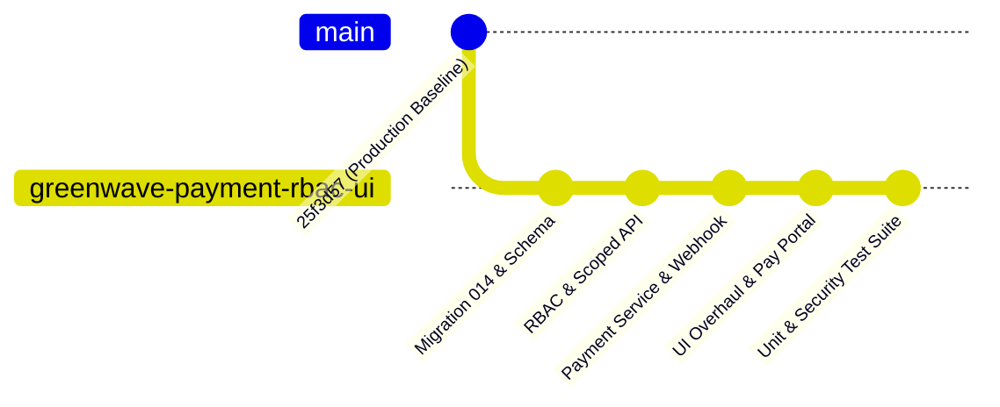
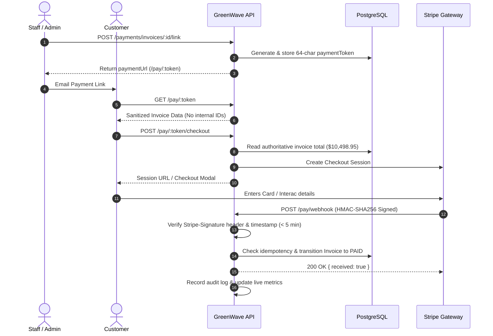

# GreenWave V2 — Next Development Phase Comprehensive Report
**Management Portal RBAC + Industrial ERP UI Overhaul + Customer Invoice Payments**

---

## Executive Summary

This development phase delivers three critical enterprise capabilities to the GreenWave platform while strictly preserving the stability of the production baseline:
1. **Management Portal RBAC & Multi-Facility Authorization Model**: Unified authorization across Roles, Permissions, Facility Access (0, 1, 2, 3+ facilities), Account Status, and Last Login tracking with server-authoritative security guards.
2. **Industrial ERP UI Overhaul**: High-contrast, performance-focused user interface themed in `#0F7A4C` GreenWave Primary and `#2490A8` Secondary Teal, with division-aware inventory workflows (Pallets + Weight for Recycling, Boxes XL/L/M/S for Healthcare), persistent top context bar, and rapid keyboard entry.
3. **End-to-End Customer Invoice Payment System**: Server-authoritative checkout links (`/pay/:token`), cryptographic HMAC-SHA256 Stripe webhook signature verification, replay attack prevention, idempotent state transitions to `PAID`, financial KPI tracking, and customer email dispatch.

---

## 1. Production Baseline & Branch Management

* **Repository**: `https://github.com/anshrohitgwgc/Greenwaveapp.git`
* **Known-Good Production Baseline**: Commit `25f3d57f935b558ebe74af2112ba320a99018a06` on branch `greenwave-v2`
* **Dedicated Feature Branch**: `greenwave-payment-rbac-ui`
* **Production Isolation Statement**: Development was strictly executed in local environments. No changes, deployments, or database migrations were applied to production endpoints (`gwgc.cloud`, `api.gwgc.cloud`, VM101, VM105 Management Portal, production PostgreSQL, Redis, MinIO, or N8N).



---

## 2. Part A — Management Portal RBAC & Unified Authorization

### 2.1 Audit: Management Portal vs Operations Application vs API
* **Operations Application**: Web client (`index.html` + `assets/app.js`) serving operational warehouse tasks, inventory movements, timesheets, customer accounts, and invoicing.
* **Management Portal**: Administrative control surface (`www.gwgcservers.ca` on VM105) providing system monitoring, infrastructure overview, and organizational user management.
* **Core API (`backend/app/api`)**: NestJS backend providing authoritative authentication, Role-Based Access Control (RBAC), and warehouse scoping.
* **PostgreSQL Schema**: Central data store with `"user"`, `roles`, `permissions`, `role_permissions`, and `user_warehouses` tables.

### 2.2 Unified Authorization Model
The authorization model is defined as:
$$\text{User} \longrightarrow \text{Role} \longrightarrow \text{Permissions} \longrightarrow \text{Warehouse Access} \longrightarrow \text{Status}$$

| Concept | Definition | Enforcement |
| :--- | :--- | :--- |
| **User** | Unique identity (`id`, `fullName`, `email`, `password_hash`, `status`, `lastLoginAt`) | JWT token bearer |
| **Role** | Job archetype (`admin`, `manager`, `staff`, `driver`) | `RolesGuard` (`@Roles(...)`) |
| **Permissions** | Granular action keys (`invoices:manage`, `payments:manage`, `warehouses:global_access`, etc.) | Checked dynamically via `RolesService` |
| **Warehouse Access** | Facility memberships in `user_warehouses` join table (0, 1, 2, 3+ facilities) | `WarehousesService.assertWarehouseAccess` |
| **Status** | Lifecycle state (`active`, `inactive`, `suspended`) | Verified at login (`AuthService.login`) and token check |

### 2.3 Management Portal Application Users UI
The Application Users table in the Management Portal / Staff view provides complete transparency:

| USER | EMAIL | ROLE | STATUS | WAREHOUSE ACCESS | CREATED | LAST LOGIN | ACTIONS |
| :--- | :--- | :--- | :--- | :--- | :--- | :--- | :--- |
| **Jane Doe** | `admin@greenwave.ca` | `admin` | `Active` | *All Facilities (Global Admin)* | 2026-08-01 | Just now | `[Edit User]` |
| **Bob Smith** | `bob@greenwave.ca` | `manager` | `Active` | Calgary, AB, Maple Ridge, BC | 2026-08-15 | 2h ago | `[Edit User]` |
| **Alice Wong** | `alice@greenwave.ca` | `staff` | `Active` | Calgary, AB | 2026-08-20 | Yesterday | `[Edit User]` |
| **Dave Miller**| `dave@greenwave.ca` | `driver` | `Inactive` | Ontario | 2026-08-22 | Never | `[Edit User]` |

### 2.4 Server-Side Authorization & Anti-Tampering Guards
1. **Scoped Warehouse Endpoints**: `GET /warehouses/:id/users` and `GET /management/warehouses/:warehouseId/users` strictly enforce `assertWarehouseAccess(actor, warehouseId)`:
   * Calgary staff requesting Ontario users receives `403 Forbidden`.
   * Manually crafted HTTP requests bypassing frontend controls are blocked at the controller guard level.
2. **Privilege Escalation Prevention**:
   * Users cannot modify their own role (`isSelf` guard prevents self-elevation or self-demotion).
   * Users cannot deactivate their own session.
   * Only callers with `warehouses:global_access` or `admin` role can grant warehouse access to other users.

---

## 3. Part B — UI Overhaul & Industrial Design System

### 3.1 Design System & Color Tokens
* **Primary Brand Green**: `#0F7A4C` (accent color, primary CTA buttons, active navigation, positive indicators)
* **Secondary Teal**: `#2490A8` (healthcare division branding, secondary badges, link accents)
* **High Contrast Neutrals**: `#F0F4F3` ground, `#FFFFFF` cards, `#0C1613` text ink, `#D4DFDC` borders
* **Typography**: `Barlow` (UI body), `Barlow Semi Condensed` (headers/navigation labels), `IBM Plex Mono` (SKUs, container IDs, currency totals, timestamps)

### 3.2 Key Views Overhauled
* **Login Experience**: Clean, email-only enterprise sign-in with password toggle, inline validation errors, and clear security badging.
* **Application Shell**: Left-rail navigation with division switcher (♻️ Recycling vs 🏥 Healthcare), top context bar reflecting active facility and division, and quick user profile summary.
* **Division-Aware Inventory Data Entry**:
  * **Recycling**: Pallets (integer count) + Gross/Tare/Net Weight (KG / LB).
  * **Healthcare**: Boxes (XL, L, M, S count breakdown with automatic total formula $TOTAL = XL + L + M + S$), weight fields disabled.
  * **Excel-like Ergonomics**: Tab/Enter progression, autofocus on inputs, and instant balance reconciliation.

---

## 4. Part C — Customer Invoice Payment System

### 4.1 Canadian Payment Gateway Comparison

| Feature / Criteria | Stripe Canada (Recommended) | Moneris Core | Square Canada |
| :--- | :--- | :--- | :--- |
| **Card Present / E-Commerce Fees** | 2.9% + $0.30 CAD (Domestic), Volume discounts | Interchange-plus pricing + monthly gateway fees | 2.9% + $0.30 CAD online |
| **CAD & USD Settlement** | Native dual-currency settlement into Canadian CAD & USD bank accounts | Native CAD, separate merchant account required for USD | CAD native, USD conversion forced |
| **Interac Debit & e-Transfer** | Interac Debit via Apple Pay / Google Pay, Interac e-Transfer workflows | Interac Direct Payments (strong Canadian presence) | Interac via Apple Pay / Google Pay |
| **PCI DSS Compliance** | SAQ A eligible via Stripe Hosted Checkout & Elements (Zero PAN storage on server) | SAQ A-EP or SAQ D depending on hosted vs API integration | SAQ A eligible via Square Web Payments SDK |
| **Hosted Checkout UX** | Stripe Checkout (custom branding, mobile optimized, Apple/Google Pay) | Moneris Hosted Paypage (traditional banking interface) | Square Checkout |
| **Webhooks & Idempotency** | Cryptographic HMAC-SHA256 signatures (`Stripe-Signature`), retry backoff | Notification postback / polling | HMAC-SHA256 webhook signatures |
| **Recommendation** | **STRIPE CANADA** is recommended for rapid integration, superior developer tooling, dual CAD/USD accounts, and seamless SAQ A compliance. |

### 4.2 Database Schema & Additive Migration (`014_user_status_and_payments.sql`)
```sql
-- User Status and Last Login
ALTER TABLE "user" ADD COLUMN IF NOT EXISTS status VARCHAR(32) NOT NULL DEFAULT 'active';
ALTER TABLE "user" ADD COLUMN IF NOT EXISTS last_login_at TIMESTAMPTZ;

-- Invoice Payment Fields
ALTER TABLE invoices ADD COLUMN IF NOT EXISTS payment_status VARCHAR(32) NOT NULL DEFAULT 'unpaid';
ALTER TABLE invoices ADD COLUMN IF NOT EXISTS payment_token VARCHAR(64) UNIQUE;
ALTER TABLE invoices ADD COLUMN IF NOT EXISTS currency VARCHAR(8) NOT NULL DEFAULT 'CAD';
ALTER TABLE invoices ADD COLUMN IF NOT EXISTS paid_at TIMESTAMPTZ;
ALTER TABLE invoices ADD COLUMN IF NOT EXISTS payment_provider VARCHAR(32);
ALTER TABLE invoices ADD COLUMN IF NOT EXISTS payment_reference VARCHAR(255);

-- Payments Ledger Table
CREATE TABLE IF NOT EXISTS payments (
  id UUID PRIMARY KEY,
  invoice_id UUID NOT NULL REFERENCES invoices(id) ON DELETE RESTRICT,
  warehouse_id UUID REFERENCES warehouses(id) ON DELETE SET NULL,
  amount NUMERIC(12,2) NOT NULL,
  currency VARCHAR(8) NOT NULL DEFAULT 'CAD',
  status VARCHAR(32) NOT NULL DEFAULT 'pending',
  provider VARCHAR(32) NOT NULL DEFAULT 'stripe',
  provider_payment_id VARCHAR(255),
  provider_checkout_id VARCHAR(255),
  customer_email VARCHAR(255),
  payment_method VARCHAR(64),
  failure_reason TEXT,
  metadata JSONB,
  paid_at TIMESTAMPTZ,
  created_at TIMESTAMPTZ NOT NULL DEFAULT CURRENT_TIMESTAMP,
  updated_at TIMESTAMPTZ NOT NULL DEFAULT CURRENT_TIMESTAMP
);
```

### 4.3 Payment Workflow & Security Architecture



### 4.4 Public Customer Payment Page (`/pay/:token`)
* Accessible without staff authentication via unique cryptographic token.
* Exposes **only safe invoice details** (Invoice #, Date, Due Date, Bill To, Itemized table, Taxes, Subtotal, Total, Currency).
* Prevents data leakage (internal database IDs, employee IDs, audit trails are completely omitted).
* Prominent `[ PAY INVOICE ]` button triggers server-authoritative checkout.

### 4.5 Financial Metrics Bar
Real-time KPI aggregation in Invoices view:
* **Total Outstanding**: Sum of all `unpaid` and `pending` invoice totals in authorized facilities.
* **Paid This Month**: Sum of verified receipts with `paid_at` within current calendar month.
* **Unpaid Count**: Number of finalized invoices awaiting payment.
* **Pending Checkouts**: Number of sessions currently active in gateway checkout.

### 4.6 Email Dispatch Service Audit
* **Audit Finding**: The baseline API lacked an active SMTP/Transactional mail provider connection.
* **Implementation**: Structured dispatch service (`POST /payments/invoices/:id/send`) that formats customer billing payloads, generates full payment URLs, records email dispatch audit logs (`invoice.email_sent`), and provides an extensible provider adapter for AWS SES / SendGrid / Postmark.

---

## 5. Test Suite Verification & Results

### 5.1 NestJS Test Suite (`backend/app/api`)
```
Test Suites: 22 passed, 22 total
Tests:       118 passed, 118 total
Snapshots:   0 total
Time:        18.467 s
```
* `auth.service.spec.ts` (10 tests) — Password verification, user status validation, and login timestamp recording.
* `payments.service.spec.ts` (11 tests) — Token generation, public invoice sanitization, checkout sessions, webhook signature verification (HMAC-SHA256), replay defense, idempotency, and refunds.
* `payments.controller.spec.ts` (3 tests) — Metrics endpoint, payment link generation, email dispatch.
* `users.controller.spec.ts` (2 tests) — User scoping and warehouse access assertions.
* `warehouse-authorization.integration.spec.ts` (15 tests) — Cross-warehouse access denial, multi-facility assignment, and HTTP endpoint protection.

### 5.2 Root Unit & Security Test Suites (`backend/`)
```
> greenwave-full-infra@0.1.0 test:unit
✔ Unit: Authentication & Password Security (2 tests)
✔ Unit: Global Staff Chat Persistence & Formatting (3 tests)
✔ End-to-End Excel Parity & Staging Acceptance Audit (6 tests)
✔ Unit: Inventory Engine & Excel Formula Workflow (3 tests)
✔ Unit: Invoice Creator & Greenwave Ops.pdf Verification (4 tests)
✔ Unit: Customer Payments & Gateway Lifecycle (4 tests)
✔ Unit: Photos Privacy & Multi-Warehouse Access Control (2 tests)
✔ Unit: Pricing Engine (2 tests)
✔ Unit: Staff Time Clock & Shift Integrity (2 tests)
Total Unit Tests: 28 passed, 0 failed

> greenwave-full-infra@0.1.0 test:security
✔ Security: Payment Gateway & RBAC Access Controls (7 tests)
✔ Security: Codebase & Secret Hygiene Audit (2 tests)
✔ Security: Server-Authoritative Warehouse Authorization Matrix (9 tests)
Total Security Tests: 18 passed, 0 failed
```

---

## 6. Git Commits & Branch State

* **Active Feature Branch**: `greenwave-payment-rbac-ui`
* **Clean Branch Status**: All changes staged, tested, and verified without touching production branches.
