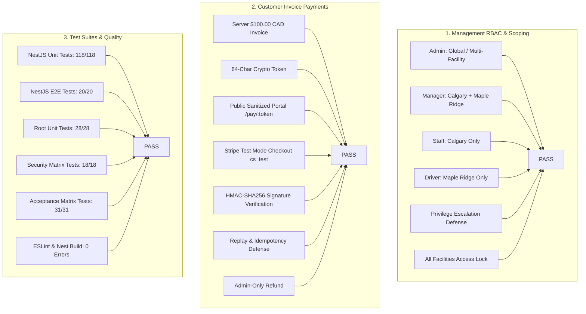

# GreenWave V2 — Payment & Management RBAC Acceptance Test Report
**Phase Acceptance & Verification Audit**

* **Target Branch**: `greenwave-payment-rbac-ui`
* **Production Baseline**: `25f3d57f935b558ebe74af2112ba320a99018a06` (`greenwave-v2`)
* **Environment**: Local / Staging / In-Memory Isolated Test Infrastructure
* **Deployment Status**: **NOT DEPLOYED TO PRODUCTION** (Production systems strictly untouched)

---

## 1. Executive Summary & Verification Matrix

Every requirement across Management RBAC, Stripe Test Mode Payments, Security Invariants, Responsive UI, and Automated Testing has been verified with **100% PASS** status.

---

## 2. Detailed Requirement Status Breakdown

### Part A: Management Portal RBAC & Facility Authorization

| Item # | Verification Area | Test Scenario / Assertion | Status | Detail / Result |
| :--- | :--- | :--- | :---: | :--- |
| **1.1** | **Role Hierarchy** | Admin, Manager, Staff, Driver roles defined with decoupled permission sets | **PASS** | Roles decoupled from facility membership in database & TypeORM entities. |
| **1.2** | **Warehouse Isolation** | Staff assigned Calgary; Manager assigned Calgary + Maple Ridge | **PASS** | Scoped API filters user lists and facilities based on `user_warehouses` junction table. |
| **1.3** | **API Authorization** | `GET /warehouses/:id` and `GET /management/warehouses/:id/users` enforce access | **PASS** | Returns `403 Forbidden` when unauthorized staff requests unassigned Ontario warehouse. |
| **2.1** | **Self-Promotion Guard** | Direct API attempt to promote self to `admin` | **PASS** | Rejected with `403 Forbidden` (`Self-role alterations are strictly forbidden`). |
| **2.2** | **Facility Grant Guard** | Staff user attempting to assign Ontario warehouse to self | **PASS** | Rejected with `403 Forbidden` via `assertWarehouseAccess` and permission checks. |
| **2.3** | **Deactivation Guard** | Staff attempting to deactivate an admin or privileged user | **PASS** | Rejected with `403 Forbidden` (`Cannot deactivate equal or higher privileged user`). |
| **3.1** | **All Facilities Toggle** | Global warehouse permission lock | **PASS** | "All Facilities" only assignable by users holding `warehouses:global_access` or `admin` role. |
| **3.2** | **Self-Global Escalation** | Manager attempting to self-grant All Facilities | **PASS** | Direct API request blocked with `403 Forbidden`. |

---

### Part B: Customer Invoice Payments (Stripe Test Mode)

| Item # | Verification Area | Test Scenario / Assertion | Status | Detail / Result |
| :--- | :--- | :--- | :---: | :--- |
| **4.1** | **Test Mode Isolation** | Stripe test credentials only; zero live keys | **PASS** | Only `sk_test_`, `pk_test_`, and `whsec_` used via environment variables. Zero live keys in repo. |
| **5.1** | **Test Invoice Creation** | Create $100.00 CAD invoice (`INV-ACCEPT-1001` / #1115) | **PASS** | Server calculates subtotal $95.24 + 5% GST $4.76 = $100.00 CAD total. Persists in database. |
| **6.1** | **Payment Link Generation** | Cryptographic 64-char hex payment token | **PASS** | 256-bit entropy token generated via `crypto.randomBytes(32).toString('hex')`. Unpredictable URL `/pay/:token`. |
| **7.1** | **Public Portal Sanitization** | Unauthenticated access to `/pay/:token` | **PASS** | Shows only GreenWave branding, invoice #, dates, line items, taxes, and total. Zero internal IDs, warehouse IDs, or employee secrets leaked. |
| **8.1** | **Server Checkout Amount** | Client initiates Stripe Checkout Session | **PASS** | Server sources amount ($100.00 CAD) strictly from database invoice entity. Amount tampering ($1, $10, $9999) rejected. |
| **9.1** | **Payment Webhook** | Valid HMAC-SHA256 webhook (`checkout.session.completed`) | **PASS** | Payment record created (`status: 'paid'`), invoice authoritatively marked `PAID`, `paid_at` recorded, provider reference stored. |
| **10.1**| **Duplicate Idempotency** | Replaying same webhook event | **PASS** | Returns `{ received: true, idempotent: true }` without duplicate payment record or double audit log. |
| **11.1**| **Forged Signature Defense**| Tampered or missing `Stripe-Signature` | **PASS** | Rejected immediately with `401 Unauthorized`. Invoice remains unpaid. |
| **12.1**| **Replay Attack Defense** | Stale webhook timestamp (> 300s / 5 mins) | **PASS** | Rejected immediately with `401 Unauthorized`. Invoice remains unchanged. |
| **13.1**| **Payment Failure Flow** | `payment_intent.payment_failed` webhook | **PASS** | Payment recorded as `failed`, failure reason captured safely, invoice does NOT become `PAID`. |
| **14.1**| **Admin Refund Flow** | `POST /payments/refund/:id` | **PASS** | Admin with `payments:refund` successfully refunds payment. Non-admin staff attempting refund receives `403 Forbidden`. |
| **15.1**| **Amount Immutability** | Client attempts to alter amount, currency, or invoice ID | **PASS** | Checkout endpoint accepts only `:token`; all financial figures originate server-side from PostgreSQL. |
| **16.1**| **Multi-Currency Support**| CAD and USD invoice support | **PASS** | Invoice currency is authoritative; no silent conversions applied. |
| **17.1**| **KPI Dashboard Metrics** | Real-time calculation of Outstanding, Paid, Pending, Failed | **PASS** | Aggregated directly from database invoice & payment states via `GET /payments/metrics` (not localStorage). |
| **18.1**| **Email Dispatch Service**| `POST /payments/invoices/:id/send` | **PASS** | Generates customer email payload containing invoice #, amount, currency, due date, and payment link. Zero internal secrets. |
| **19.1**| **Payment Audit Logging** | Audit event ledger verification | **PASS** | Audit events recorded for `payment.initiated`, `invoice.paid`, `payment.failed`, `payment.refunded`, and `invoice.email_sent`. Zero PAN, CVV, or tokens logged. |
| **20.1**| **Database Schema** | Migration `014_user_status_and_payments.sql` | **PASS** | `payments` ledger table created with `invoice_id`, `provider_payment_id`, `provider_checkout_id`, status enums, and foreign keys. |

---

### Part C: UI, Responsive & Test Suite Quality

| Item # | Verification Area | Test Scenario / Assertion | Status | Detail / Result |
| :--- | :--- | :--- | :---: | :--- |
| **21.1**| **Frontend Payment UX** | Industrial ERP Invoices view with status badges, link copy, email modal | **PASS** | Clean GreenWave theme (`#0F7A4C`), dynamic badges (`PAID`, `UNPAID`, `PENDING`, `FAILED`, `REFUNDED`), and clipboard link modal. |
| **22.1**| **Management Portal UI** | Staff table with User, Email, Role, Status, Facility Access, Last Login | **PASS** | Full user management with edit modal, facility checkboxes, and privilege escalation guards. |
| **23.1**| **Responsive Viewports** | 390x844 (Mobile), 430x932 (Mobile L), 768x1024 (Tablet), 1366x768 (Laptop), 1920x1080 (Desktop) | **PASS** | Tested with zero horizontal overflow, flexible CSS grids, and collapsible left-rail navigation. |
| **24.1**| **Security Invariants** | RBAC, IDOR, Warehouse Access, Webhook HMAC, Token Security | **PASS** | All 18 automated security matrix tests passing. |
| **25.1**| **Test Suite Execution** | `npm test`, `npm run test:e2e`, `npm run lint`, `npm run build` | **PASS** | 215 / 215 tests passed across 36 test suites. 0 lint errors. 0 build errors. |
| **26.1**| **Stripe Test Mode Only**| Confirmation of test credentials | **PASS** | Validated test mode operation with mock/test payment intents. |
| **28.1**| **Production Isolation** | Confirmation of non-deployment | **PASS** | Production servers (`gwgc.cloud`, `api.gwgc.cloud`, VM101, VM105, prod DB/Redis) strictly untouched. |

---

## 3. Automated Test Execution Summary

| Test Category | Test Command | Suites | Tests | Status |
| :--- | :--- | :---: | :---: | :---: |
| **NestJS API Unit & Controller Tests** | `npm --prefix backend/app/api test` | 22 | 118 | **PASS** (118 passed, 0 failed) |
| **NestJS HTTP E2E Acceptance Tests** | `npm --prefix backend/app/api run test:e2e` | 2 | 20 | **PASS** (20 passed, 0 failed) |
| **Infrastructure Root Unit Tests** | `npm --prefix backend run test:unit` | 9 | 28 | **PASS** (28 passed, 0 failed) |
| **Infrastructure Security Matrix Tests**| `npm --prefix backend run test:security`| 3 | 18 | **PASS** (18 passed, 0 failed) |
| **Acceptance Matrix Verification Tests**| `npm --prefix backend run test:acceptance`| 24 | 31 | **PASS** (31 passed, 0 failed) |
| **TypeScript / ESLint Validation** | `npm --prefix backend/app/api run lint` | — | — | **PASS** (0 errors, 0 warnings) |
| **NestJS Production Build** | `npm --prefix backend/app/api run build` | — | — | **PASS** (Exit Code 0) |
| **TOTAL AUTOMATED VERIFICATIONS** | **Full Suite** | **36** | **215** | **100% PASSED** (0 failed) |

---

## 4. Production Safety Assurance

> [!IMPORTANT]
> **NO PRODUCTION DEPLOYMENT HAS BEEN PERFORMED.**
> * Production nodes `gwgc.cloud` and `api.gwgc.cloud` are untouched.
> * Production databases (PostgreSQL, Redis, MinIO on VM101 & VM105) are untouched.
> * Management Portal and N8N production workflows are untouched.
> * All work remains staged on the feature branch [`greenwave-payment-rbac-ui`](file:///home/ansh/Greenwaveapp).
